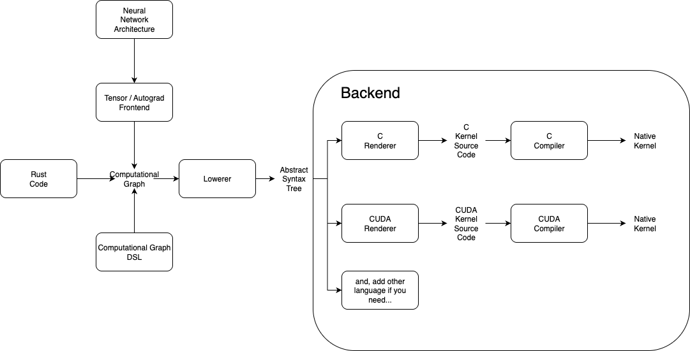

[](https://github.com/uthree/harp/actions/workflows/rust.yml)
[](https://www.rust-lang.org/)

# harp: A Tensor Computation Library with JIT Compilation
**WORK IN PROGRESS**

"Harp" is a transpiler for multidimensional array computation, deep learning, and computer science, inspired by [tinygrad](https://github.com/tinygrad/tinygrad) and [luminal](https://github.com/luminal-ai/luminal).
It automatically generates optimal C kernels for CPUs or GPUs from a computational graph of a multidimensional array.

## Architecture

- Tensor / Autograd Frontend: A frontend that makes it easy to handle tensor calculations, automatic differentiation, etc.
- Lowerer: Responsible for converting the computational graph into a C-like abstract syntax tree (AST).
- Renderer: Renders the AST as source code in the target language.
- Compiler: An interface that abstracts compiler calls.

## Optimization
In Harp, optimization is done in two main stages:
- Computational graph optimization: Tensor-wise graph optimizations are performed (e.g., fusing multiple element-wise operations into a single operation node).
- AST optimization: Removing unnecessary operations found in the abstract syntax tree (such as meaningless operations like a + 0) and unrolling loops.

## Quick Start

### Installation

Add Harp to your `Cargo.toml`:

```toml
[dependencies]
harp = { git = "https://github.com/uthree/harp" }
```

### Basic Usage

```rust
use harp::prelude::*;

fn main() {
    // Create a computation graph
    let mut graph = Graph::new();

    // Create input nodes
    let a = graph.input("a")
        .with_dtype(DType::F32)
        .with_shape(vec![10, 20])
        .build();

    let b = graph.input("b")
        .with_dtype(DType::F32)
        .with_shape(vec![10, 20])
        .build();

    // Perform operations (using operator overloading)
    let result = a + b;

    // Register output node
    graph.output("result", result);
}
```

### Using Helper Functions

```rust
use harp::prelude::*;

// Reduce operations
let sum = reduce_sum(input, 0);      // Sum along axis 0
let max_val = reduce_max(input, 1);  // Max along axis 1

// Element-wise operations
let reciprocal = recip(input);       // Reciprocal
let maximum = max(a, b);             // Element-wise maximum
```

### View Operations

```rust
use harp::prelude::*;

// Transpose
let transposed = input.view.clone().permute(vec![1, 0]);

// Add/remove dimensions
let unsqueezed = input.view.clone().unsqueeze(0);
let squeezed = input.view.clone().squeeze(2);

// Flip
let flipped = input.view.clone().flip(0);
```

## Advanced Example: Matrix Multiplication

Harp allows you to build complex operations by combining View operations, Elementwise operations, and Reduce operations. Here's how to implement matrix multiplication C = A @ B:

```rust
use harp::prelude::*;
use std::rc::Rc;

// Create graph
let mut graph = Graph::new();

// A: [m, n] matrix
let a = graph.input("A")
    .with_dtype(DType::F32)
    .with_shape(vec![3, 4])
    .build();

// B: [n, p] matrix
let b = graph.input("B")
    .with_dtype(DType::F32)
    .with_shape(vec![4, 5])
    .build();

// Matrix multiplication implementation:
// 1. A[m,n] → A[m,n,1] (unsqueeze)
let a_view = a.view.clone().unsqueeze(2);
let a_unsqueezed = GraphNode(Rc::new(GraphNodeData {
    dtype: a.dtype.clone(),
    op: GraphOp::View(a_view.clone()),
    src: vec![a.clone()],
    view: a_view.clone(),
}));

// 2. B[n,p] → B[n,p,1] (unsqueeze) → B[1,n,p] (permute)
let b_view = b.view.clone().unsqueeze(2).permute(vec![2, 0, 1]);
let b_permuted = GraphNode(Rc::new(GraphNodeData {
    dtype: b.dtype.clone(),
    op: GraphOp::View(b_view.clone()),
    src: vec![b.clone()],
    view: b_view.clone(),
}));

// 3. Expand to [m,n,p]
let a_broadcast_view = a_view.expand(vec![Expr::from(3), Expr::from(4), Expr::from(5)]);
let a_broadcast = GraphNode(Rc::new(GraphNodeData {
    dtype: a.dtype.clone(),
    op: GraphOp::View(a_broadcast_view.clone()),
    src: vec![a_unsqueezed],
    view: a_broadcast_view,
}));

let b_broadcast_view = b_view.expand(vec![Expr::from(3), Expr::from(4), Expr::from(5)]);
let b_broadcast = GraphNode(Rc::new(GraphNodeData {
    dtype: b.dtype.clone(),
    op: GraphOp::View(b_broadcast_view.clone()),
    src: vec![b_permuted],
    view: b_broadcast_view,
}));

// 4. Element-wise multiplication
let product = a_broadcast * b_broadcast;

// 5. Reduce along axis 1 (k-axis): [m,n,p] → [m,p]
let result = product.reduce_sum(1);

graph.output("C", result);
// Result: C[3,5] = A[3,4] @ B[4,5]
```

This demonstrates the power of composing primitive operations to build complex computations.

## API Documentation

The library exports the following main modules:

- **`prelude`**: Commonly used types and traits (recommended to import with `use harp::prelude::*`)
- **`graph`**: Computation graph construction
- **`lowerer`**: Graph to AST conversion
- **`backend`**: Backend implementations (Metal, etc.)
- **`ast`**: Intermediate representation
- **`opt`**: Optimization passes

Top-level re-exports for convenience:
- `Graph`, `GraphNode`, `DType`, `AxisStrategy` from `graph`
- `Compiler`, `Renderer`, `Kernel`, `Buffer` from `backend`
- `Lowerer` from `lowerer`

# License
This repository is dual licensed under [Apache 2.0](./LICENSE_APACHE) and [MIT](./LICENSE_MIT), so you can use it either way if you need to.
